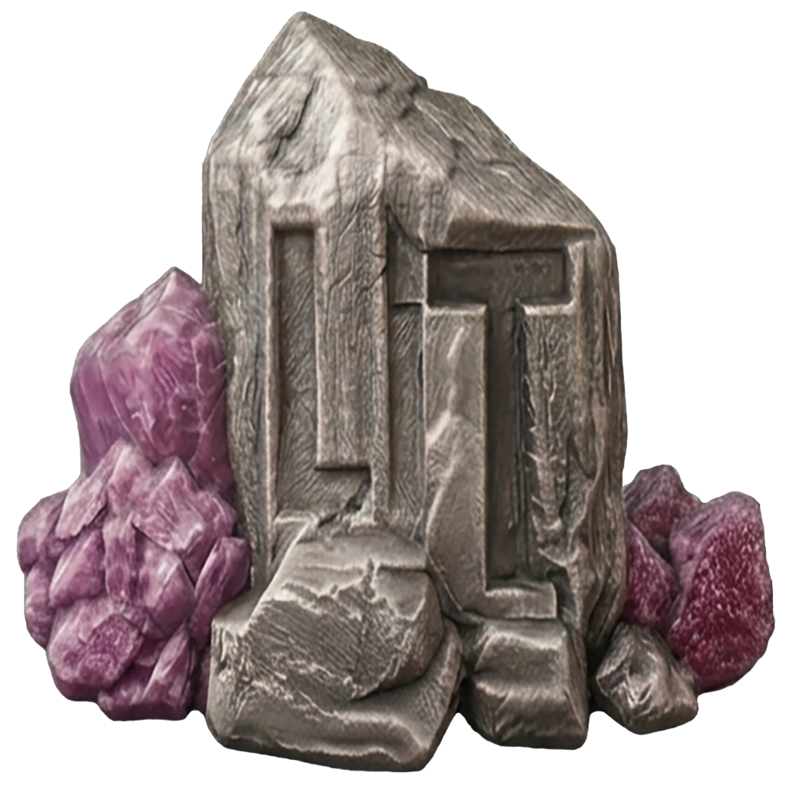

<p align="center">
  
</p>

# Lithium Core 0.25.2

Lithium Core 0.25.2 is the Lithium aux-chain port of the v25.2 Core codebase.
It keeps Lithium's chain identity, AuxPoW merged-mining rules, Blake-256 hash
policy, and wallet formats while adding the Taproot-era Core codebase,
descriptor-wallet support, SQLite wallet support, ZMQ, and Linux USDT
tracepoints for hardened release builds.

## Mainnet Consensus Changes In 0.25.2

Lithium 0.25.2 follows the 0.15.21 SegWit activation and then activates the
next UTXO-compatible script rule sets in a staged order. Miners and pools
should use the daemon-provided block template version; do not manually rewrite
version bits or AuxPoW chain-id bits.

| Rule set | Mainnet policy in Lithium 0.25.2 |
|---|---|
| SegWit (`BIP141` / `BIP143` / `BIP147`) | Already active from 0.15.21; buried at height `1956300`. No new SegWit signaling window in 0.25.2. |
| Subsidy ladder restore | Mainnet preserves the 0.15.21 `50 LIT` history before height `1949476`; from height `1949476`, 0.25.2 uses Lithium's legacy 0.8 ladder: `0.48 LIT` before `1999`, `48 LIT` before `175000`, `24 LIT` before `350000`, `12 LIT` before `525000`, `6 LIT` before `650000`, `3 LIT` before `800000`, `1.5 LIT` before `975000`, then `1 LIT`. |
| `BIP34` coinbase height | Height activation at `1977347`; `BIP34Hash = uint256{}`. |
| `BIP65` / CLTV | Height activation at `1977347`; required for standard CLTV atomic-swap refunds. |
| `BIP66` / strict DER | Height activation at `1977347`. |
| Taproot (`BIP340` / `BIP341` / `BIP342`) | BIP9 deployment bit `2`, start `1782871200` (`2026-07-01 02:00:00 UTC`), timeout `1814407200` (`2027-07-01 02:00:00 UTC`), minimum activation height `1980707`. |

Only Taproot is a future BIP9-signaled deployment in 0.25.2. `BIP34`,
`BIP65`, `BIP66`, and buried SegWit are height rules. AuxPoW pools should use
`createauxblock` / `getauxblock` from Lithium Core; the daemon computes the
correct top bits, Lithium chain-id bits, and Taproot bit `2` during BIP9
`started` and `locked_in` states.

## About Lithium

Lithium is a Blake-family merged-mined cryptocurrency. This release is built
for compatibility with existing Lithium history while adding modern wallet,
script, and release-hardening support from the upstream v25.2 Core codebase.

- Uses the Blake-256 hashing algorithm, 8 rounds
- Based on the v25.2 Core codebase
- Uses AuxPoW / merged mining with chain ID `0x0006`
- Uses the autotools build system (`./autogen.sh`, `./configure`, `make`)
- Supports legacy Berkeley DB wallets and descriptor SQLite wallets
- Keeps Lithium txids on single SHA-256
- Uses HASH256/double SHA-256 for witness-v0 BIP143 signing
- Keeps BIP340/BIP341/BIP342 Taproot tagged hashes byte-compatible with upstream vectors

| Network Info | Value |
|---|---|
| Algorithm | Blake-256, 8 rounds |
| Block time | 3 minutes |
| Difficulty retarget | Every 20 blocks |
| PoW limit | `0x000000ffff000000000000000000000000000000000000000000000000000000` |
| Coinbase maturity | 120 blocks |
| AuxPoW chain ID | `0x0006` |
| AuxPoW start height | `160000` mainnet, `0` testnet/regtest |
| Default P2P port | 12007 |
| RPC port | 12000 |
| Regtest RPC port | 18332 |
| Mainnet genesis | `000000fcf39055b547e94e610f1008b8046f942bbb730e8b6dfa6232931902db` |
| Mainnet Bech32 HRP | `lit` |
| Testnet Bech32 HRP | `tlit` |
| Regtest Bech32 HRP | `rlit` |

## Block Subsidy

Lithium uses a forward-activated subsidy ladder. `nSubsidyHalvingInterval` is
intentionally unused (set to `INT_MAX` in chainparams):

- Height `0` (genesis): `5 LIT`
- Before activation height `1949476`: `50 LIT` flat (preserves the 0.15.21 chain history)
- At/after activation, the legacy 0.8 height-tier ladder applies:
  - `< 1999`: `0.48 LIT`
  - `< 175000`: `48 LIT`
  - `< 350000`: `24 LIT`
  - `< 525000`: `12 LIT`
  - `< 650000`: `6 LIT`
  - `< 800000`: `3 LIT`
  - `< 975000`: `1.5 LIT`
  - otherwise: `1 LIT`

## Wallet Support

This release is a dual-wallet build:

- Legacy Berkeley DB wallets are supported for existing `wallet.dat` users.
- Descriptor SQLite wallets are supported for modern wallet workflows.

Release builds are expected to compile with both `USE_BDB=true` and
`USE_SQLITE=true`.

## Quick Start

```bash
git clone https://github.com/BlueDragon747/lithium.git
cd lithium
bash ./build.sh --help
```

For most users, downloading a prebuilt release from GitHub Releases is the
simplest path. Use `build.sh` to build release artifacts locally.

## Build Options

```bash
bash ./build.sh [PLATFORM] [TARGET] [OPTIONS]

Platforms:
  --native          Build natively on this machine (Linux, macOS, or Windows)
  --appimage        Build portable Linux AppImage (requires Docker)
  --windows         Cross-compile for Windows from Linux (requires Docker)
  --macos           Cross-compile for macOS from Linux (requires Docker)

Targets:
  --daemon          Build daemon only (lithiumd + lithium-cli + lithium-tx)
  --qt              Build Qt wallet only (lithium-qt)
  --both            Build daemon and Qt wallet (default)

Docker options:
  --pull-docker     Pull prebuilt Docker images from Docker Hub
  --build-docker    Build Docker images locally from repo Dockerfiles
  --no-docker       For --native on Linux: build directly on the host

Other options:
  --hardened-release
                   Native Linux release profile: enable SQLite, ZMQ, and USDT
                   and fail the build if configure disables any of them
  --jobs N          Parallel make jobs
```

The build script is the supported entrypoint for release artifacts. It sets the
expected Lithium branding, dual wallet backends, ZMQ support, and Linux USDT
tracepoint support for hardened release builds.

## Platform Build Instructions

### Native Linux

Direct host build:

```bash
bash ./build.sh --native --both --no-docker --hardened-release --jobs "$(nproc)"
```

Docker-backed native build:

```bash
bash ./build.sh --native --both --pull-docker --hardened-release --jobs "$(nproc)"
DOCKER_NATIVE=sidgrip/native-base:26.04 bash ./build.sh --native --both --build-docker --hardened-release --jobs 5
```

- Native Linux release outputs are written under `outputs/Ubuntu-20/`,
  `outputs/Ubuntu-22/`, `outputs/Ubuntu-24/`, or `outputs/Ubuntu-26/`
  depending on the host or selected Docker image.
- `--hardened-release` enables and verifies Berkeley DB legacy wallet support,
  SQLite descriptor wallet support, ZMQ, and Linux USDT tracepoints.
- Each Ubuntu output folder includes `README.md`, `install-deps.sh`,
  `lithium.conf`, `build-info.txt`, `config.log`, and `test-config.ini`.
- Ubuntu-native outputs are bare binaries that rely on host-installed native
  runtime packages; use the generated `install-deps.sh` in the output folder on
  the target system.

### Linux AppImage

```bash
bash ./build.sh --appimage --pull-docker
```

- Uses `sidgrip/appimage-base:22.04`.
- Produces `outputs/AppImage/Lithium-0.25.2-x86_64.AppImage`.
- Intended for Ubuntu `22.04+`.
- Direct launch on Ubuntu `22.04.5` needs `sudo apt install libfuse2`.
- Direct launch on Ubuntu `24.04.4` and `26.04` needs
  `sudo apt install libfuse2t64`.
- Fallback launch remains `--appimage-extract-and-run`.

### Windows

```bash
bash ./build.sh --windows --both --pull-docker
```

- Runs on Linux with Docker using `sidgrip/mxe-base:latest`.
- Writes loose cross-built outputs to `outputs/Windows/`.
- Produces `lithiumd`, `lithium-cli`, `lithium-tx`, `lithium-wallet`,
  `lithium-util`, and `lithium-qt` `.exe` artifacts.

### macOS

Cross-build from Linux:

```bash
bash ./build.sh --macos --both --pull-docker
```

- Runs on Linux with Docker using `sidgrip/osxcross-base:sdk-26.2`.
- Produces artifacts in `outputs/Macosx/`.

Native build on macOS:

```bash
bash ./build.sh --native --both
```

- Uses Homebrew dependencies on the Mac host.
- Native macOS builds write to `outputs/Macosx/`.

## Output Structure

```text
outputs/
├── AppImage/
│   ├── Lithium-0.25.2-x86_64.AppImage
│   ├── README.md
│   └── build-info.txt
├── Macosx/
│   ├── Lithium-Qt.app
│   ├── lithium-cli-0.25.2
│   ├── lithium-qt-0.25.2
│   ├── lithium-tx-0.25.2
│   ├── lithium-util-0.25.2
│   ├── lithium-wallet-0.25.2
│   ├── lithium.conf
│   └── lithiumd-0.25.2
├── Ubuntu-22/
│   ├── README.md
│   ├── install-deps.sh
│   ├── lithium-256.png
│   ├── lithium-cli
│   ├── lithium.conf
│   ├── lithium.desktop
│   ├── lithium-qt
│   ├── lithium-tx
│   ├── lithium-util
│   ├── lithium-wallet
│   └── lithiumd
├── Ubuntu-24/
├── Ubuntu-26/
├── Windows/
│   ├── lithium-cli-0.25.2.exe
│   ├── lithium-qt-0.25.2.exe
│   ├── lithium-tx-0.25.2.exe
│   ├── lithium-util-0.25.2.exe
│   ├── lithium-wallet-0.25.2.exe
│   └── lithiumd-0.25.2.exe
└── release/
    ├── Lithium-0.25.2-Ubuntu-22-x86_64.tar.gz
    ├── Lithium-0.25.2-Ubuntu-24-x86_64.tar.gz
    ├── Lithium-0.25.2-Ubuntu-26-x86_64.tar.gz
    ├── Lithium-0.25.2-Windows-x86_64.zip
    ├── Lithium-0.25.2-macOS-x86_64.tar.gz
    ├── Lithium-0.25.2-x86_64.AppImage
    └── SHA256SUMS
```

Ubuntu `20.04` is also supported by the native Docker image and will write to
`outputs/Ubuntu-20/` when that image or host is selected.

## Docker Images

When using `--pull-docker`, the build script uses these prebuilt images:

| Image | Purpose |
|---|---|
| `sidgrip/native-base:20.04` | Native Linux Ubuntu 20.04 build |
| `sidgrip/native-base:22.04` | Native Linux Ubuntu 22.04 build |
| `sidgrip/native-base:24.04` | Native Linux Ubuntu 24.04 build, default native Docker image |
| `sidgrip/native-base:26.04` | Native Linux Ubuntu 26.04 hardened release lane |
| `sidgrip/appimage-base:22.04` | Ubuntu 22+ AppImage build |
| `sidgrip/mxe-base:latest` | Windows cross-compile |
| `sidgrip/osxcross-base:sdk-26.2` | macOS cross-compile |

For lower-level source-build configuration options, see
[`doc/build-unix.md`](doc/build-unix.md), [`doc/build-osx.md`](doc/build-osx.md),
and the output of `./configure --help`.

## Multi-Coin Builder

For coordinated BlakeStream-family wallet builds, see the
[Blakestream Installer](https://github.com/SidGrip/Blakestream-Installer).

## Upgrade Notes

When syncing 0.25.2 from old 0.8/0.15.21-era chains, header presync can look slow or restart because v25 verifies low-work header chains before storing them. For trusted bootstrap only, use `-minimumchainwork=0 -connect=<trusted-node>` and remove those options after the node catches up.

When moving from older 0.15.21-era datadirs, remove stale `peers.dat` if startup
reports a peers checksum mismatch. A full reindex may be required when replaying
old chain data with the 0.25.2 database and chainparams.

## License

Lithium Core is released under the terms of the MIT license. See
[COPYING](COPYING) for details.
